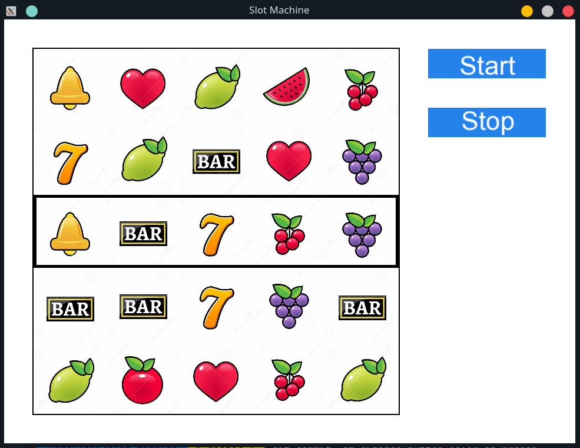

# Slot machine simulator

A simple, little and quite pointless slot machine simulator
built using SFML.



Its main purpose is to show my ability of coming up with 
a clean architecture. 

- State machine is in a heart of everything
- Backend logic and drawing logic are completely separated
- No ties to SFML windowing and drawing
- Very easy to add new slots (add new texture, load it, add 
  new enum for it)

Its features are:
- Spinning the reels!
- Slots are always perfectly at the center after stopping

# How to build

## Linux
Install `libsfml-dev` and `libsfml-system2.5` using your 
distro's package manager. Then build the project using
```sh
mkdir build && cd build
cmake ..
make -j $(nproc)
```

## Windows
1. Compile or download compiled SFML using [official guide](https://www.sfml-dev.org/tutorials/2.5/#getting-started).
2. Install SFML files to standard library path (optionally)

Then use cmake to get your favorite generator files:
```sh
mkdir build && cd build
cmake .. \
    -DDCMAKE_LIBRARY_PATH=<SFML installation path> \
    -G <Your favorite generator>
```

`-DDCMAKE_LIBRARY_PATH` is not required if SFML is installed 
to default library location.

After that, you'll have generator, using which you'll be
able to compile the project.

# How to run
Launch executable. It expects `Resources` directory near itself,
so either set cwd to project root folder or copy `Resources` folder
to the location of executable.

If SFML's library directory is not in `PATH`, add it to `PATH`
or copy .dll/.so SFML files to executable folder. SFML is 
dynamically linked and expects library files in order to run.
